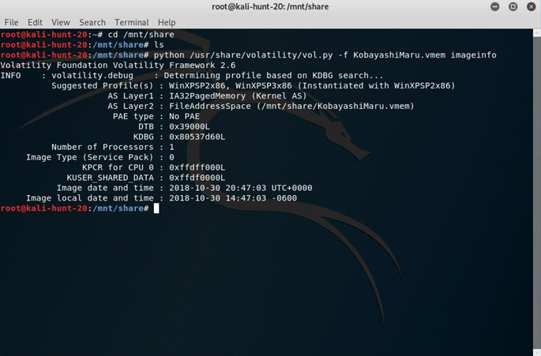
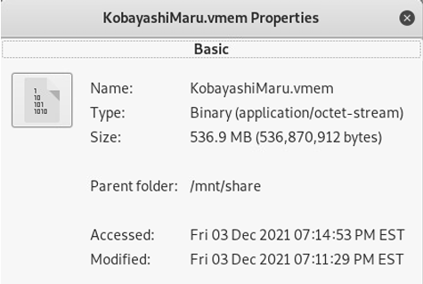

# Introduction

In this lab, I must apply my knowledge and  investigate the memory dump of a computer that is potentially affected by malicious activity. I will be doing so with a memory dump of the computer. From what I have gathered, I have found that this is the most effective way to investigate computers as not even a rootkit can be concealed if the investigator is careful enough. For this lab, I will be using the SimSpace virtual machine kali-hunt-20 and the open source memory forensics framework Volatility to investigate the memory dump of a .vmem file named “KobayashiMaru”. The objective here is to gather information about the computer, investigate suspicious files and processes, and, overall, find out what (if anything) is afflicting the computer. 

## Getting Started and Background Information

Using my pre-existing credentials for SimSpace, I log in and access terminal kali-hunt-20. Once logging in, I navigate through the file explorer and find the KobayashiMaru.vmem file in the “shared files” directory. With this located, I then open the application search panel and locate Volatility. To be precise, “Volatility is an open source (sic.) framework used for memory forensics and digital investigation […] It can analyse (sic.) raw memory dumps, crash dumps, virtual machine snapshots, VMware dumps (.vmem) […] and many others” (Open Source For You). This is an especially useful tool as it can investigate the data left on volatile memory which, for reference, refers to the memory that is lost once the computer is powered off. In other words, this is most likely data captured from the computer’s Random-Access Memory (RAM)(ScienceDirect). It is magnanimous, then, that this capture file was made since in a realworld situation, this information would be lost in a matter of hours which would make investigation and diagnosis extremely difficult. Nevertheless, with both materials in my possession, I begin my investigation.

## Initial Observations of the Dump File

Volatility is a Python-based program and is run through the command terminal. As such, to locate my file, I use the command “cd /mnt/share to locate the .vmem file. After some trial and error, I realize that I will need to call the “python” command and specify the “vol.py” file every time I wish to use Volatility. As such, I use the command “python /usr/share/volatility 
vol.py -f KobayashiMaru.vmem imageinfo” to call basic information about the dump file. As mentioned, the first half of the command is me calling the Volatility script and the -f option specifies the memory dump’s file name. The SANS Memory Forensics Cheat Sheet explains that the “imageinfo” plugin “display[s] memory image metadata.” With this command, I can see some preliminary information about the computer from which the memory dump originated.

- <i>Figure 1</i>: The output after using the “imageinfo” command. The first half (up to -f) denotes the Python script call and its directory and the -f option tells Volatility to specifically work on my file. The operating system is found on the line saying, “suggested profiles.” It gives two possibilities, but the true operating system is a 32-bit version of Windows XP Service Package 3 (WinXPSP3x86)

<p align="center">
  
</p>

The first line of information describes the computer’s operating system. The output suggests that the computer is running either Windows XP SP2 x86, or Windows XP SP3 x86 with both being 32-bit operating systems (Volatility Foundation, SEEED Studio). Initially, I had thought that it was running SP2, but after getting an error when attempting to list the processes (explained in the next section), I found that the computer was actually using Windows XP SP3 x86 as the operating system. As such, the computer is running an operating system that was released on April 21, 2008 (Wikipedia). At first glance, this leads me to believe that there are likely one or more holes in security that an attacker can exploit. As a final note, “a memory dump size is the same as that of the size of RAM” (Chamikara). Therefore, to determine how much RAM is included, I need only to look at the size of the dump file. After analyzing the properties of the file, I conclude that 536.9 MB of RAM is included in the analysis. This is about all the surface information I can gather about the dump file. 
This is useful, of course, but to find any malicious activity, I will have to dig deeper.

- <i>Figure 2</i>: The file properties panel of the KobayashiMaru.vmem capture file. Notice the file size of 536.9 megabytes. This therefore means that there are 536.9 megabytes worth of RAM included in the analysis.

<p align="center">
  
</p>

## Examining Dump File Processes: Gathering Information and Identifying Rogue Processes

I feel that the real value behind capturing volatile memory is the fact that you can see the processes that were ongoing while the computer was active. As mentioned, this data is lost once the computer is turned off and, relatively speaking, an investigator only has precious few moments to capture this. Analyzing the computer’s ongoing processes at the time may be 
extremely useful as any malicious executable files and suspicious processes will have been captured and saved in the dump file. 

To call the process list with Volatility, I use the command “python /usr/share/volatility/vol.py -f KobayashiMaru.vmem --profile=WINXPSP2x86 pslist” to list the processes captured on the dump file. However, Volatility encounters an error and states that I am using an invalid profile. After entering the second profile name, WINXPSP3x86, Volatility accepts it, and I am given the process list. Therefore, this leads me to conclude with absolute certainty that the computer’s operating system was a 32-bit version of Windows XP with Service Package 3. With the process list present, I can now search through it and see if I find anything suspicious. 

At first glance, this does seem to be an average box. I have a list of the processes here, but no information about them such as their locations in the computer. Due to this, I believe it will be tricky to determine if any processes are malicious just by looking at their names (I do not imagine an attacker naming his payload something like virus.exe or informationstealer.exe). Therefore, I will have to analyze each process carefully. The best way I could think of is 
manually looking up each process name with Google to determine its function and legitimacy. The following is a list I compiled of suspicious processes with justification (The full process list can be found in Figure 3):  

| Process        | Analysis           |
|:-------------|:------------------|:------|
| hxdef100.exe           | I am getting mixed reviews about this one. Some experts on chat forums claim it is a virus. | nice  |
| iroffer.exe | Process Library states that "iroffer.exe is a process registered as a backdoor vulnerability which may be installed for malicious purposes by an attacker allowing access to your computer from remote locations, stealing passwords, Internet banking, and personal data" (Process List). There are also three iterations of it. Definitely suspicious.   | nice  |
| poisonivy.exe           | I stand corrected. With this process, even the name is suspicious. The process is registered in MITRE ATT&CK's database as a malicous remote access tool (a full list of its functionalities is found on their website listed in the References section).      | hmm   |
| soffice.exe           | This is a non-essential third-party process and is overall recognized as harmless. However, there is a possibility that it could be camouflaged malware (File.net). | yumm  |
| soffice.bin           | Same reasoning as soffice.exe | yumm  |
| rundll32.exe           | An essential Windows command-line program but is registered as a backdoor vulnerability to the software Backdoor.W32.Ranky (Process Library). | yumm  |

### There's a horizontal rule below this.

* * *

### Here is an unordered list:

*   Item foo
*   Item bar
*   Item baz
*   Item zip

### And an ordered list:

1.  Item one
1.  Item two
1.  Item three
1.  Item four

### And a nested list:

- level 1 item
  - level 2 item
  - level 2 item
    - level 3 item
    - level 3 item
- level 1 item
  - level 2 item
  - level 2 item
  - level 2 item
- level 1 item
  - level 2 item
  - level 2 item
- level 1 item

### Small image


### Large image


### Definition lists can be used with HTML syntax.

<dl>
<dt>Name</dt>
<dd>Godzilla</dd>
<dt>Born</dt>
<dd>1952</dd>
<dt>Birthplace</dt>
<dd>Japan</dd>
<dt>Color</dt>
<dd>Green</dd>
</dl>

```
Long, single-line code blocks should not wrap. They should horizontally scroll if they are too long. This line should be long enough to demonstrate this.
```

```
The final element.
```
