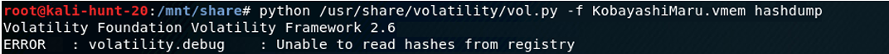

# Introduction

In this lab, I must apply my knowledge and  investigate the memory dump of a computer that is potentially affected by malicious activity. I will be doing so with a memory dump of the computer. From what I have gathered, I have found that this is the most effective way to investigate computers as not even a rootkit can be concealed if the investigator is careful enough. For this lab, I will be using the SimSpace virtual machine kali-hunt-20 and the open source memory forensics framework Volatility to investigate the memory dump of a .vmem file named “KobayashiMaru”. The objective here is to gather information about the computer, investigate suspicious files and processes, and, overall, find out what (if anything) is afflicting the computer. 

## Getting Started and Background Information

Using my pre-existing credentials for SimSpace, I log in and access terminal kali-hunt-20. Once logging in, I navigate through the file explorer and find the KobayashiMaru.vmem file in the “shared files” directory. With this located, I then open the application search panel and locate Volatility. To be precise, “Volatility is an open source (sic.) framework used for memory forensics and digital investigation […] It can analyse (sic.) raw memory dumps, crash dumps, virtual machine snapshots, VMware dumps (.vmem) […] and many others” (Open Source For You). This is an especially useful tool as it can investigate the data left on volatile memory which, for reference, refers to the memory that is lost once the computer is powered off. In other words, this is most likely data captured from the computer’s Random-Access Memory (RAM)(ScienceDirect). It is magnanimous, then, that this capture file was made since in a realworld situation, this information would be lost in a matter of hours which would make investigation and diagnosis extremely difficult. Nevertheless, with both materials in my possession, I begin my investigation.

## Initial Observations of the Dump File

Volatility is a Python-based program and is run through the command terminal. As such, to locate my file, I use the command “cd /mnt/share to locate the .vmem file. After some trial and error, I realize that I will need to call the “python” command and specify the “vol.py” file every time I wish to use Volatility. As such, I use the command “python /usr/share/volatility 
vol.py -f KobayashiMaru.vmem imageinfo” to call basic information about the dump file. As mentioned, the first half of the command is me calling the Volatility script and the -f option specifies the memory dump’s file name. The SANS Memory Forensics Cheat Sheet explains that the “imageinfo” plugin “display[s] memory image metadata.” With this command, I can see some preliminary information about the computer from which the memory dump originated.

- <i>Figure 1</i>: The output after using the “imageinfo” command. The first half (up to -f) denotes the Python script call and its directory and the -f option tells Volatility to specifically work on my file. The operating system is found on the line saying, “suggested profiles.” It gives two possibilities, but the true operating system is a 32-bit version of Windows XP Service Package 3 (WinXPSP3x86)

  

The first line of information describes the computer’s operating system. The output suggests that the computer is running either Windows XP SP2 x86, or Windows XP SP3 x86 with both being 32-bit operating systems (Volatility Foundation, SEEED Studio). Initially, I had thought that it was running SP2, but after getting an error when attempting to list the processes (explained in the next section), I found that the computer was actually using Windows XP SP3 x86 as the operating system. As such, the computer is running an operating system that was released on April 21, 2008 (Wikipedia). At first glance, this leads me to believe that there are likely one or more holes in security that an attacker can exploit. As a final note, “a memory dump size is the same as that of the size of RAM” (Chamikara). Therefore, to determine how much RAM is included, I need only to look at the size of the dump file. After analyzing the properties of the file, I conclude that 536.9 MB of RAM is included in the analysis. This is about all the surface information I can gather about the dump file. 
This is useful, of course, but to find any malicious activity, I will have to dig deeper.

- <i>Figure 2</i>: The file properties panel of the KobayashiMaru.vmem capture file. Notice the file size of 536.9 megabytes. This therefore means that there are 536.9 megabytes worth of RAM included in the analysis.

  

## Examining Dump File Processes: Gathering Information and Identifying Rogue Processes

I feel that the real value behind capturing volatile memory is the fact that you can see the processes that were ongoing while the computer was active. As mentioned, this data is lost once the computer is turned off and, relatively speaking, an investigator only has precious few moments to capture this. Analyzing the computer’s ongoing processes at the time may be 
extremely useful as any malicious executable files and suspicious processes will have been captured and saved in the dump file. 

To call the process list with Volatility, I use the command “python /usr/share/volatility/vol.py -f KobayashiMaru.vmem --profile=WINXPSP2x86 pslist” to list the processes captured on the dump file. However, Volatility encounters an error and states that I am using an invalid profile. After entering the second profile name, WINXPSP3x86, Volatility accepts it, and I am given the process list. Therefore, this leads me to conclude with absolute certainty that the computer’s operating system was a 32-bit version of Windows XP with Service Package 3. With the process list present, I can now search through it and see if I find anything suspicious. 

At first glance, this does seem to be an average box. I have a list of the processes here, but no information about them such as their locations in the computer. Due to this, I believe it will be tricky to determine if any processes are malicious just by looking at their names (I do not imagine an attacker naming his payload something like virus.exe or informationstealer.exe). Therefore, I will have to analyze each process carefully. The best way I could think of is 
manually looking up each process name with Google to determine its function and legitimacy. The following is a list I compiled of suspicious processes with justification (The full process list can be found in Figure 3):  

| Process        | Analysis           |
|:-------------|:------------------|
| hxdef100.exe           | I am getting mixed reviews about this one. Some experts on chat forums claim it is a virus.
| iroffer.exe | Process Library states that "iroffer.exe is a process registered as a backdoor vulnerability which may be installed for malicious purposes by an attacker allowing access to your computer from remote locations, stealing passwords, Internet banking, and personal data" (Process List). There are also three iterations of it. Definitely suspicious.
| poisonivy.exe           | I stand corrected. With this process, even the name is suspicious. The process is registered in MITRE ATT&CK's database as a malicous remote access tool (a full list of its functionalities is found on their website listed in the References section).
| soffice.exe           | This is a non-essential third-party process and is overall recognized as harmless. However, there is a possibility that it could be camouflaged malware (File.net).
| soffice.bin           | Same reasoning as soffice.exe
| rundll32.exe           | An essential Windows command-line program but is registered as a backdoor vulnerability to the software Backdoor.W32.Ranky (Process Library).

* * *

- <i>Figure 3</i>: The process list of the capture file. The processes highlighted in magenta and the circled process will be important later.

  

Given this information, it is very possible that there was malicious activity going on in this computer. To deepen my investigation, I can scan the computer's connections to find any remote IP addresses. In doing so, I may be able to not only locate intruders, but also determine the process(es) they are running. To begin, I use the “connections” plugin to identify any TCP connections that were active at the time of the scan (Github -Volatility Command Reference). I enter the corresponding command and am met with no results.

- <i>Figure 4</i>: The empty results returned after using the "connections" command. This means that there were no connections being made to the computer via internet.

  

I can at least conclude, then, that there were no active TCP connections to the computer. However, I can look even further and use the “connscan” command to find any remote IP addresses connecting to the computer. In doing so, I find three IP addresses with remote connections.

- <i>Figure 5</i>: The results returned after using the "connscan" command. Notice the presence of three remote IP addresses and that they all have PIDs which turned out to belong to malware.

  

Assuming there are not supposed to be any remote connections to the memory dump’s computer, I believe these remote connections are intruders and the processes they are using are malicious. Therefore, my predictions were mostly correct since the rogue processes are: iroffer.exe, bircd.exe, and poisonivy.exe.

## Finding User Account Names and Passwords

I have a list of potential processes, but I could possibly find even more evidence of a security breach by uncovering any unregistered or unauthorized users. I have already discovered from the previous section that there are three remote connections to the computer, so the objective is to see if I can find any unusual account names.

To begin, I use the command “hivelist” to find available registry hives. For reference, a registry hive is “a major section of the registry that contains registry keys, registry subkeys, and registry values” (Lifewire). This would be a great place to look for passwords. However, after entering the command, I am not returned with any results.

- <i>Figure 6</i>: The empty results returned after using the "hivelist" command. This means that no registry information, usernames, or passwords were stored in this capture file.

  

As a result, this stunts the rest of the process of searching through hives. My alternative, however, is to look through any hashes stored on the computer. Using the “hashdump” command, I attempt to locate any hashes that may contain user passwords. Unfortunately, Volatility returns with an error stating that it is unable to read hashes from the registry.

- <i>Figure 7</i>: The error returned after attempting the "hashdump" command. Once again, no passwords are stored in this capture file.

  

Based on my findings (and quite a bit of persistence), I must conclude that any usernames or passwords stored on this computer are unable to be found.

## Viewing the Dynamically Linked Libraries

The next step of the investigation is to analyze the Dynamically Linked Libraries (DLLs) captured on the dump file. A DLL “is a module that contains functions and data that can be used by another module” (Microsoft). They “provide a way to modularize applications so that their functionality can be updated and reused more easily” (Microsoft). This means that multiple programs can simultaneously use elements within a DLL. Most DLLs are for essential Windows functions. So, it stands to reason, then, that a cyber attacker would disguise his payload as an essential Windows DLL so as to avoid suspicion. This is a major element of an attack known as DLL sideloading. DLL sideloading is a form of cyber attack in which “malware places a spoofed malicious DLL file in a Windows’ WinSxS directory so that the operating system loads it instead of a legitimate file" (Mandiant). It seems that Windows is not picky about which DLLs it shares, as long as the file in question has the name and file type it is looking for. That means that any suspicious DLLs in the memory dump are likely to be in the wrong directory.

Using the command “dlllist,” Volatility returns with a list of DLLs and lists each element of the DLL along with its location. I suspect that I will be able to find a suspicious DLL by looking up its normal properties and comparing them to what I find in the dump. For instance, any Windows-essential DLL should be located in the system32 directory. If it is not, then it is likely to be malware. During my analysis, I found out that the command line of hxdef100.exe (PID 1416) mentions that it is a rootkit!

- <i>Figure 8</i>: The hxdef100.exe process appearing in the DLL list. Notice how it is located in a directory that is literally named "hxdefrootkit". Also notice its presence with essential Windows System 32 functions.

  

This would prove my initial prediction that it is a suspicious process. It is most definitely malicious, and it is spreading its influence on other functions in the computer. Farther on in my analysis, I notice trouble. CryptCat (cryptcat.exe PID 1472), a data writing tool, has a command line path that links to the hxdef100 rootkit directory (Figure 10).

- <i>Figure 9</i>: The malicious cryptcat.exe file. It is also located in the hxdefrootkit directory. This is what I believe the user downloaded by mistake.

  

Next, there is a “hidden” directory holding the bircd.exe (PID 1480) file. It is nesting itself with other essential Windows functions which leads me to conclude that bircd is not a DLL, but a virus masquerading as one. 

-<i>Figure 10</i>: The malicious bircd.exe process. This turned out to be a malicious .exe file acting as an important DLL.

  

Similarly, the iroffer.exe (PID 1728) process I was questioning was also in a hidden folder and nested with system32 DLLs. The other iroffer PEBs are unreadable.

- <i>Figure 11</i>: The three iroffer processes. The first and third entries are unreadable, but the second entry (and the one I focus on) is located in a hidden directory not even psscan picked up.

  

Unsurprisingly, the poisonivy.exe (PID 480) file is also there but is alarmingly located in the system32 directory!

- <i>Figure 12</i>: The poisonivy.exe process. Notice how it is nested directly in the computer's System 32 directory.

  

On the other hand, it seems I was wrong about the soffice processes since they seem to be in the correct locations. Next, the nc.exe (PID 532) is another iteration of NetCat, and it is incorrectly located with system32 functions under the directory “ftproot.”

- <i>Figure 13</i>: The malicous nc.exe file. Once again, it is part of the rootkit and with essential Windows programs.

  

Lastly, the winvnv4.exe (PID 548) program is calling on a fake version which is located in the same “ftproot” rootkit directory.

- <i>Figure 14</i>: The malicious winvnc4.exe file. Another rootkit file with System 32 processes.

  

And so, although the DLL list initially made it seem like an average box, this memory dump indicates that computer has some huge problems.

## Discussion

Surprisingly, it seems a fair amount of my predictions was correct. This memory dump indicates that in total, there are nine malicious programs on this computer! What makes it worse is that a fair amount of them is part of a rootkit which would have otherwise been undetectable if not for my tedious line scrubbing. However, I was correct in my assumption that 
the processes operated by the remote connections were malicious. Even so, there were still quite a few that would have been missed if I had only relied on that or my hunch about the process list. Therefore, although it may be the most difficult, I believe that searching through the DLL lists is the best and most effective way to find malware.

From the instant I saw remote connections, I immediately suspected a rootkit. Still going off the assumption that this was a computer that was not meant to normally have remote connections, my theory is that the user downloaded a fake copy of CryptCat which actually contained a rootkit. Once downloaded and installed, there was now a backdoor available for attackers to enter and interfere with the computer. From there, little by little, the hackers would remotely connect to the afflicted computer and plant their malware with the original user none the wiser. On top of that, they would disguise their payloads as seemingly harmless Windows System 32 functions and even redirect some essential processes so that they would 
instead pick up their malware. It also seems to be a team effort since there are three unique connections who all seem to have the same goal. In short, the user accidentally downloaded a rootkit, and that was all the attackers needed to wreck the computer.

# Conclusion

First, I feel that this lab does an especially good job of emphasizing the dangers of a rootkit. With only a backdoor, an attacker has everything he needs to inflict significant damage on the computer. It also showed that you should not trust a program simply because it has a benign or important-sounding name. Always validate file directories and make sure that they 
are folders that you recognize.

In terms of limitations, the only major one I found was the difficulty in identifying malicious processes with the “malfind” command. For some reason, it would not work for me and give me the wrong output so that I would not be able to search for the ‘MZ’ flag which marks the process as malicious. Moreover, the lack of the ability to copy virtual machine text onto my own computer’s clipboard totally hampered any investigation using Total Virus. Then, of course, the lack of any hive or hash data was also a significant blow to the investigation. Nevertheless, using alternative methods, I do feel that I still got the information I needed to properly complete this lab.

This was a fun lab and once again reaffirmed that this is something I greatly enjoy doing in cyber security! The skills that I have learned from this lab and the others will be invaluable in my pursuit of a career dealing with intrusion detection and incident response.
